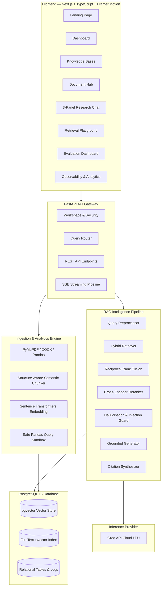
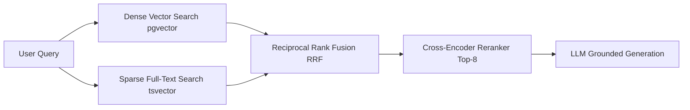
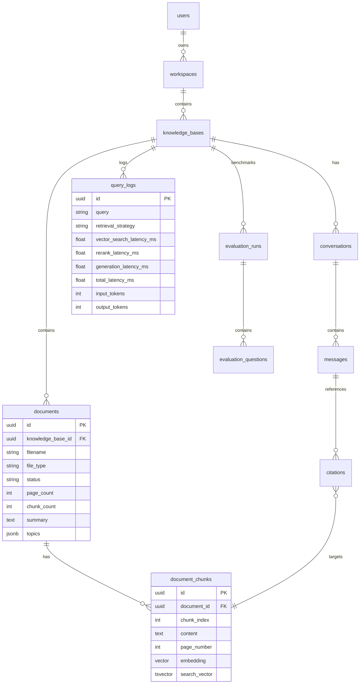

# RAGForge — Evidence-First AI Knowledge Engine

> **A production-grade, multi-document AI research platform engineered for verifiable, grounded knowledge retrieval and generation.**

[](https://nextjs.org/)
[](https://fastapi.tiangolo.com/)
[](https://github.com/pgvector/pgvector)
[](https://groq.com/)
[](https://www.typescriptlang.org/)
[](https://tailwindcss.com/)

---

## 1. Executive Summary & Problem Statement

Standard Large Language Model chatbots frequently hallucinate, blend information across unrelated documents, and offer zero verifiable grounding. In enterprise research, legal diligence, financial analytics, and technical documentation, **an ungrounded answer is worse than no answer**.

**RAGForge** is built on one foundational principle:
> **Every important claim must be traceable back to exact document evidence.**

RAGForge implements a multi-stage, evidence-first Retrieval-Augmented Generation (RAG) architecture:
1. **Semantic & Lexical Hybrid Search** via PostgreSQL `pgvector` + `tsvector`
2. **Reciprocal Rank Fusion (RRF)** for optimal candidate blending
3. **Cross-Encoder Reranking** for high-precision context compression
4. **Grounded Generation** powered by the **Groq API** (`llama-3.3-70b-versatile`)
5. **Interactive Citation Inspector** with chunk-level attribution, page numbers, and relevance metrics
6. **Structured Data Execution Sandbox** for safe natural-language querying of CSV datasets
7. **End-to-End Evaluation Framework** measuring Faithfulness, Context Precision, Recall, and Hallucination Rates

---

## 2. High-Level Architecture



---

## 3. Core Capabilities & Deep-Dive Features

### 🔍 Hybrid Retrieval (Vector + Keyword Search)
- **Dense Vector Search**: 384-dimensional cosine distance similarity queries using `pgvector` HNSW indexes.
- **Sparse Keyword Search**: PostgreSQL full-text search using `tsvector` with `ts_rank` and English stemming.
- **Reciprocal Rank Fusion (RRF)**: Merges dense and sparse ranked lists using standard $RRF(d) = \sum \frac{1}{k + r(d)}$ ($k=60$).



### 🎯 Cross-Encoder Reranking
Initial retrieval prioritizes high recall by selecting top 20–30 candidate chunks. A cross-encoder model (`ms-marco-MiniLM-L-6-v2`) performs joint attention on `(query, passage)` pairs to rerank the candidates and select the 5–8 most authoritative chunks.

### 🛡️ Grounded Generation & Citation System
- Generation prompt strictly enforces evidence boundaries.
- Numbered citations `[1]`, `[2]` directly resolve to specific chunk IDs, document filenames, page numbers, and rerank scores.
- Interactive Evidence Inspector lets users click any citation to preview exact excerpts and retrieval metadata.

### 📊 "Explain Retrieval" Observability
Transparent query breakdown displaying:
- Query categorization (Single-Doc, Multi-Doc, Data Query)
- Retrieved candidate count vs. reranked context count
- Millisecond-level latency breakdown across Vector Search, Keyword Search, Fusion, Reranking, and LLM Generation
- Application-derived **Evidence Confidence**, **Quality**, and **Coverage** indicators.

### 📈 Structured Data & CSV Query Mode
- Automatic schema profiling and column type detection.
- LLM generates safe, read-only Pandas expressions.
- Strict security guardrails prevent arbitrary code execution, SQL injections, or OS-level access.

### 🧪 RAG Evaluation Framework
Built-in evaluation engine assessing:
- **Faithfulness**: Proportion of generated claims grounded in retrieved context.
- **Answer Relevance**: Semantic alignment between prompt and generated response.
- **Context Precision**: Signal-to-noise ratio in retrieved passages.
- **Context Recall**: Retrieval coverage of expected ground-truth answers.
- **Hallucination Rate**: Automated tracking of ungrounded statements.

---

## 4. Technology Stack

| Layer | Component | Description |
|---|---|---|
| **Frontend** | Next.js 15+ (App Router), TypeScript | Server & Client Components, Responsive UI |
| **Styling** | Tailwind CSS, Framer Motion, Lucide | Dark-first aesthetic, micro-animations, glassmorphism |
| **Data Viz** | Recharts | Interactive Radar Charts, Latency Stacked Bar Charts |
| **Backend** | Python 3.11+, FastAPI, Pydantic v2 | High-performance asynchronous REST API |
| **Database** | PostgreSQL 16 + pgvector | Relational schema + vector similarity search |
| **ORM** | SQLAlchemy 2.0 (AsyncIO) + asyncpg | Modern mapped SQL models with connection pooling |
| **LLM Inference**| Groq Cloud API (`llama-3.3-70b-versatile`)| Ultra-fast LPU inference, OpenAI-compatible SDK |
| **Embeddings** | `sentence-transformers` (`all-MiniLM-L6-v2`) | Local 384-dimensional dense representations |
| **Reranker** | `cross-encoder/ms-marco-MiniLM-L-6-v2` | MS MARCO calibrated passage ranking |
| **Parsers** | PyMuPDF, python-docx, pandas | Text and tabular extraction with page retention |
| **Containerization**| Docker & Docker Compose | Multi-container orchestration |

---

## 5. Database Schema



---

## 6. Quick Start & Local Setup

### Prerequisites
- [Docker & Docker Compose](https://www.docker.com/)
- [Node.js 18+](https://nodejs.org/) (for running frontend directly)
- [Python 3.11+](https://www.python.org/) (for running backend directly)
- A [Groq API Key](https://console.groq.com/)

### 1. Clone & Configure Environment
```bash
git clone https://github.com/your-username/ragforge.git
cd ragforge
cp .env.example .env
```

Edit `.env` and set your `GROQ_API_KEY`:
```ini
GROQ_API_KEY=gsk_your_groq_api_key_here
GROQ_MODEL=llama-3.3-70b-versatile
```

### 2. Run with Docker Compose (Recommended)
```bash
docker compose up --build
```
- **Frontend**: `http://localhost:3000`
- **Backend API Docs**: `http://localhost:8000/docs`
- **Postgres Database**: `localhost:5432`

---

## 7. Running Without Docker (Manual Development)

### Start PostgreSQL with pgvector
```bash
docker run -d --name ragforge-db -p 5432:5432 -e POSTGRES_USER=ragforge -e POSTGRES_PASSWORD=ragforge -e POSTGRES_DB=ragforge pgvector/pgvector:pg16
```

### Start Backend
```bash
cd backend
python -m venv .venv
source .venv/bin/activate # On Windows: .venv\Scripts\activate
pip install -r requirements.txt

# Seed demo dataset (TechCorp financials + AI research report + sales CSV)
python -m app.scripts.seed_demo

# Launch API server
uvicorn app.main:app --host 0.0.0.0 --port 8000 --reload
```

### Start Frontend
```bash
cd frontend
npm install
npm run dev
```

Open `http://localhost:3000` in your browser.

---

## 8. REST API Specification

| Method | Endpoint | Description |
|---|---|---|
| `GET` | `/api/knowledge-bases` | List all knowledge bases with document counts |
| `POST` | `/api/knowledge-bases` | Create a new isolated knowledge base |
| `POST` | `/api/documents/upload` | Upload & initiate async document ingestion pipeline |
| `GET` | `/api/documents` | List documents with statuses and summaries |
| `GET` | `/api/documents/{id}/chunks` | Inspect all chunks, page numbers, and tokens |
| `POST` | `/api/chat` | SSE streaming chat endpoint with citations & metadata |
| `POST` | `/api/retrieval/search` | Search playground endpoint supporting strategy comparison |
| `GET` | `/api/analytics/summary` | Retrieve aggregated latency, volume, and success rates |
| `GET` | `/api/analytics/queries` | Retrieve detailed query logs with timing breakdowns |
| `POST` | `/api/evaluations` | Execute automated RAG quality benchmark run |

---

## 9. Technical Interview Talking Points

1. **Why Hybrid Search instead of pure vector search?**
   Dense bi-encoders excel at semantic matching but fail on exact part numbers, acronyms, product SKUs, and rare terminology. Combining `pgvector` with PostgreSQL `tsvector` using Reciprocal Rank Fusion ensures high recall across both conceptual and keyword-exact queries.

2. **Why two-stage retrieval with cross-encoder reranking?**
   Bi-encoders compute vector embeddings for documents and queries independently, missing cross-token interactions. Cross-encoders process `(query, document)` jointly through all attention layers, providing much higher precision at the cost of latency. By using bi-encoders for broad recall (top-20) and a cross-encoder for top-8 filtering, we achieve high NDCG@10 within sub-200ms budgets.

3. **How does RAGForge defend against hallucinations?**
   - Explicit system prompt grounding restricting generation strictly to provided context.
   - Minimum evidence threshold scoring; queries below threshold return clear uncertainty responses instead of fabricated answers.
   - Citation validation mapping assertions directly to extracted chunk IDs.

4. **How are prompt injection attacks mitigated?**
   Retrieved context is explicitly treated as **untrusted data** and isolated inside structured context blocks. The model instructions strictly prevent text found within document excerpts from overriding top-level system commands.

---

## 10. License

MIT License. Designed and engineered for high-performance AI knowledge engineering.
